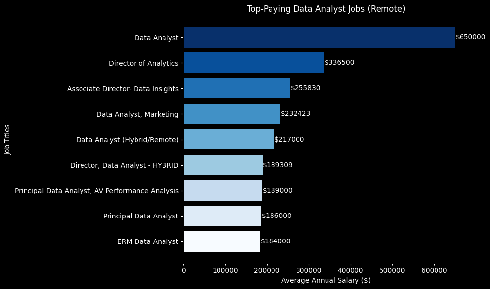

# Introduction
📊Dive into the data job market! Focusing on data analyst roles, this project explores 💰 top-paying jobs,🔥in-demand skills, and where high demand meets high salary in data analytics. 

🔍 SQL queries? Check them out in the repository named : [sql_data_project folder](/sql_data_project)

# Background
🚀 Driven by the desire to navigate the data analyst job market more effectively, this project was born out of the desire to identify the best-paid and most sought-after skills, simplifying the work of others to find the best jobs. 🌟

The data comes from Luke Barousse’s **SQL Course**. It’s packed with information on jobs, salaries, locations, and essential skills. 📊


### The questions I wanted to answer through my SQL queries were:
1. What are the top-paying data analyst jobs? 
2. What skills are required for these top-paying jobs?
3. What skills are most in demand for data analysts?
4. Which skills are associated with higher salaries?
5. What are the most optimal skills to learn?
# Tools I Used

For my deep dive into the data analyst job market, I harnessed the power of several key tools:
- **PostgreSQL**: The chosen database management system, ideal for handling the job posting data. - **Visual Studio Code**: My go-to for database management and executing **SQL** queries.
- **Git & GitHub**: Essential for version control and sharing my **SQL** scripts and analysis, ensuring collaboration and project tracking.
# The Analysis
Each query for this project aimed at investigating specific aspects of the data analyst job market.
Here's how I approached each question:

### Top Paying Data Analyst Jobs
To identify the highest-paying roles, I filtered data analyst positions by average yearly salary and location, focusing on remote jobs. This query highlights the high opportunities in the field. 📊🚀


```sql
SELECT
    job_id,
    job_title,
    job_location,
    job_schedule_type,
    salary_year_avg,
    job_posted_date,
    name as company_name
FROM
    job_postings_fact
LEFT JOIN company_dim ON job_postings_fact.company_id = company_dim.company_id
WHERE 
    job_title_short = 'Data Analyst' AND
    job_location = 'Anywhere' AND
    salary_year_avg IS NOT NULL
ORDER BY 
    salary_year_avg DESC
LIMIT 10
```
Here's the breakdown of the top data analyst jobs in 2023:
- **Wide Salary Range:** Top 10 paying data analyst roles span from $184,000 to $650.000, indicating significant salary potential in the field.
- **Diverse Employers:** Companies like SmartAsset, Meta, and AT&T are among those offering high salaries, showing a broad interest across different industries.
- **Job Title Variety:** There's a high diversity in job titles, from Data Analyst to Director of Analytics, reflecting varied roles and specializationd within data analytics.


*Bar graph visualizing the salary for the top 10 salaries for data analysts; ChatGPT generated this graph from SQL query results*
# Skills required for these top-paying jobs

I applied the following filters to the dataset to answer the question "What skills are required for these top-paying jobs?":

### 1. Selection of Top-Paying Jobs:

- Filtered jobs with the title "Data Analyst" 🕵️‍♂️.
- Limited job location to "Anywhere" 🌍.
- Considered only jobs with non-null average annual salary 💵.
- Ordered the jobs by average annual salary in descending order 📉.
- Selected the top 10 highest-paying jobs 🎯

### 2. Joining with Skills:

- After selecting the high-paying jobs, I joined with the skills table to get the skills associated with these jobs 🛠️.
- Ordered the results by average annual salary in descending order 🏆.

```sql
WITH top_paying_jobs AS (
    SELECT
        job_id,
        job_title,
        job_location,
        job_schedule_type,
        salary_year_avg,
        job_posted_date,
        name as company_name
    FROM
        job_postings_fact
    LEFT JOIN company_dim ON job_postings_fact.company_id = company_dim.company_id
    WHERE 
        job_title_short = 'Data Analyst' AND
        job_location = 'Anywhere' AND
        salary_year_avg IS NOT NULL
    ORDER BY 
        salary_year_avg DESC
    LIMIT 10
)

SELECT 
    top_paying_jobs.*,
    skills
FROM
    top_paying_jobs
INNER JOIN skills_job_dim ON  top_paying_jobs.job_id = skills_job_dim.job_id
INNER JOIN skills_dim ON skills_job_dim.skill_id = skills_dim.skill_id
ORDER BY salary_year_avg DESC
```
With these filters applied to the provided dataset, I identified the following skills associated with the top-paying jobs: 

- 1. SQL 💾
- 2. Python 🐍
- 3. R 📊
- 4. Azure ☁️
- 5. Databricks 🔥
- 6. AWS ☁️
- 7. Pandas 🐼
- 8. PySpark ⚡
- 9. Jupyter 📓
- 10. Excel 📈
- 11. Tableau 📊
- 12. Power BI 📊
- 13. PowerPoint 📉


# What I Learned
🔥 Complex Query Crafting: Mastered the art of advanced SQL, merging tables like a pro and wielding WITH clauses for ninja-level temp table maneuvers. 💪

📊 Data Aggregation: Got cozy with GROUP BY and turned aggregate functions like COUNT() and AVG() into my data-summarizing sidekicks. 📈

🔍 Analytical Wizardry: Leveled up my real-world puzzle-solving skills, turning questions into actionable, insightful SQL queries. 🧩
# Conclusions

### Insights
1. **Top-Paying Data Analyst Jobs**: The highest-paying jobs for data analysts that allow remote work offer a wide range of salaries, the highest at $650,000!
2. **Skills for Top-Paying Jobs**: High-paying data analyst jobs require advanced proficiency in SQL, suggesting it's a critical skill for earning a top salary.
3. **Most In-Demand Skills**: SQL is also the most demanded skill in the data analyst job market, thus making it essential for job seekers.
4. **Skills with Higher Salaries**: Specialized skills, such as SVN and Solidity, are associated with the highest average salaries, indicating a premium on niche expertise.
I
5. **Optimal Skills for Job Market Value**: SQL leads in demand and offers for a high average salary, positioning it as one of the most optimal skills for data analysts to learn to maximize their market value.
### Closing Thoughts
This project enhanced my SQL skills and provided valuable insights into the data analyst job
market. The findings from the analysis serve as a guide to prioritizing skill development and job search efforts. Aspiring data analysts can better position themselves in a competitive job market by focusing on high-demand, high-salary skills. This exploration highlights the importance of continuous learning and adaptation to emerging trends in the field of data analytics
